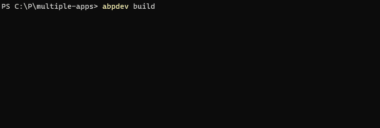
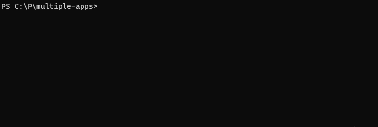
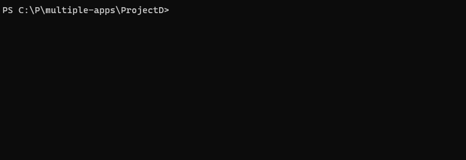
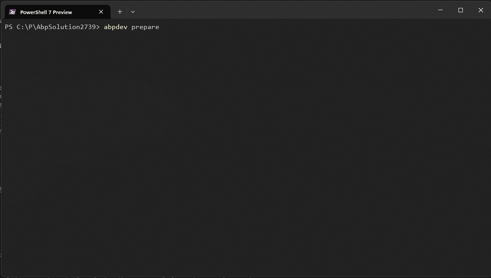
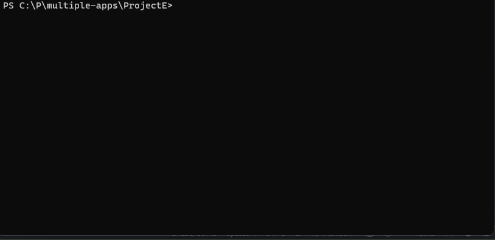
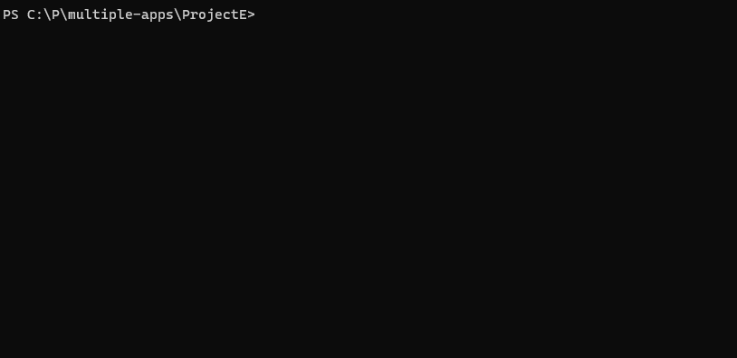

<p align="center">
  
</p>

# AbpDevTools
A set of tools to make development with ABP easier. It's a dotnet tool and accessed via `abpdev` **CLI** command.

It helps the developer, build, run, replace, and manage logs of the projects. It makes running **multiple** solutions and projects easier.

> Done with [Enisn.Templates.CLI](https://github.com/enisn/Enisn.Templates.CLI). You can build similar CLI tools with this template.

<a href="https://www.nuget.org/packages/AbpDevTools"></a>

# Installation

- Install [AbpDevTools from NuGet](https://www.nuget.org/packages/AbpDevTools) as dotnet tool:
```bash
dotnet tool update -g AbpDevTools
```

- Installation for a specific runtime other than the latest:
    
    ```bash
    dotnet tool update -g AbpDevTools --framework net8.0
    # or
    dotnet tool update -g AbpDevTools --framework net6.0
    ```

> This package is compiled for .NET 6.0, 7.0, 8.0 and 9.0. So you can install it for a specific runtime. If you don't specify a runtime, it'll install the latest version.

## Local Installation
If you don't have access to the package source. You can install it from the source code by the following code:

```bash
pwsh install.ps1
```

# Getting Started
  You can watch the **'Getting Started'** video for onboarding this tool:
  
  <a href="https://youtu.be/wG7MfdIq_Fo">  </a>


# Usage

Execute `abpdev` command in the terminal and it'll show you the help message.

```bash
abpdev --help
```

# Commands
The following commands are available:

## abpdev build
Builds all solutions/projects in the current directory recursively. _(Multiple solutions)_

```
abpdev build <workingdirectory> [options]
```

```bash
abpdev build -h

PARAMETERS
  workingdirectory  Working directory to run build. Probably project or solution directory path goes here. Default: . (Current Directory) 
OPTIONS
  -f|--build-files  (Array) Names or part of names of projects or solutions will be built.
  -i|--interactive  Interactive build file selection. Default: "False".
  -c|--configuration
  -h|--help         Shows help text.
```

Convention: `*.sln` files are considered as solutions and `*.csproj` files are considered as projects.



### Example commands

- Run in a specific path
    ```bash
    abpdev build C:\Path\To\Projects
    ```

- Run in a specific configuration
    ```bash
    abpdev build C:\Path\To\Projects -c Release
    ```


- Run in a specific path with specific configuration and specific projects
    ```bash
    abpdev build C:\Path\To\Projects -c Release -f ProjectA.csproj ProjectB.csproj
    ```

- Run in interactive mode **(Select projects to build)**
    ```bash
    abpdev build -i
    ```
    

## abpdev run
Runs the solution in the current directory. _(Multiple solution, multiple applications including DbMigrator)_

```
abpdev run <workingdirectory> [options]
```

```bash
PARAMETERS
  workingdirectory  Working directory to run build. Probably project or solution directory path goes here. Default: . (Current Directory)

OPTIONS
  -w|--watch        Watch mode Default: "False".
  --skip-migrate    Skips migration and runs projects directly. Default: "False".
  -a|--all          Projects to run will not be asked as prompt. All of them will run. Default: "False".
  --no-build        Skipts build before running. Passes '--no-build' parameter to dotnet run. Default: "False".
  -i|--install-libs  Runs 'abp install-libs' command while running the project simultaneously. Default: "False".
  -g|--graphBuild   Uses /graphBuild while running the applications. So no need building before running. But it may cause some performance. Default: "False".
  -p|--projects     (Array) Names or part of names of projects will be ran.
  -c|--configuration
  -e| --env        Virtual Environment name. You can manage virtual environments by using 'abpdev env config'
  -h|--help         Shows help text.
```

Convention: `*.csproj` files with specific names are considered as applications or dbmigrators.

> _Use `abpdev run config` command to change project name conventions according to your requirements_


### Example commands

- Run multiple solutions
    ```bash
    abpdev run C:\Path\To\Top\Folder\Of\Solutions
    ```
    

- Run in a specific path
    ```bash
    abpdev run C:\Path\To\Projects
    ```

- Run in a specific configuration and specific path
    ```bash
    abpdev run C:\Path\To\Projects -c Release
    ```

- Run all projects instead prompt selection
    ```bash
    abpdev run -a
    ```

    

- Skip migration and run projects directly
    ```bash
    abpdev run --skip-migrate
    ```

- Run in watch mode
    ```bash
    abpdev run -w
    ```
    > Please note that we cannot print URL's because dotnet does give any output.

## Virtual Environments
Virtual environments are used to run multiple solutions with different configurations. For example, you can run different solutions with different environments _(connectionstrings etc.)_.

 You can manage virtual environments by using `abpdev env config` command and use those pre-configured environments with other commands like: `abpdev run -e SqlServer`. This command will use the environment named SqlServer. You can set different connectionstrings for each environment.

```bash
abpdev env config
```

> You'll see the following screen. You can add, edit, delete, and select virtual environments.
> ```json
> {
>  "SqlServer": {
>    "Variables": {
>      "ConnectionStrings__Default": "Server=localhost;Database={AppName}_{Today};User ID=SA;Password=12345678Aa;TrustServerCertificate=True"
>    }
>  },
>  "MongoDB": {
>    "Variables": {
>      "ConnectionStrings__Default": "mongodb://localhost:27017/{AppName}_{Today}"
>    }
>  }
>}
> ```
> **{Today}** will be replaced with the current date. So you can run multiple solutions with different databases.
> **{AppName}** will be replaced with the application name. So you can run multiple solutions with different databases. _When app name couldn't be detected, folder name will be used.


### Example commands

- Run in a specific virtual environment
    ```bash
    abpdev run -e SqlServer
    ```


## abpdev prepare
Prepares the project for the first running on this machine. Automatically detects project dependencies, starts required environment apps (databases, message brokers), installs ABP libraries, and creates local configuration files. You can use the `abpdev.yml` configuration file to run the project with different environments without changing the `appsettings.json` files. You can modify the created `abpdev.yml` file to change or add new environment variables to run profile.

```
abpdev prepare <workingdirectory> [options]
```

```bash
abpdev prepare -h

PARAMETERS
  workingdirectory  Working directory to run build. Probably project or solution directory path goes here. Default: . (Current Directory)

OPTIONS
  --no-config       Do not create local configuration file. (abpdev.yml) Default: "False".
  -h|--help         Shows help text.
```

Convention: The command analyzes project dependencies to determine which environment apps are needed (SQL Server, MongoDB, Redis, etc.) and automatically configures the environment accordingly.



### Example commands

- Prepare project in current directory
    ```bash
    abpdev prepare
    ```

- Prepare project in a specific path
    ```bash
    abpdev prepare C:\Path\To\Projects
    ```

- Prepare without creating local configuration files
    ```bash
    abpdev prepare --no-config
    ```

This command performs the following operations:
- **Dependency Analysis**: Scans projects for database and messaging dependencies
- **Environment Apps**: Starts required Docker containers (SQL Server, MongoDB, Redis, etc.)
- **Library Installation**: Runs `abp install-libs` to install client-side libraries
- **Blazor Bundling**: Bundles Blazor WASM projects
- **Configuration**: Creates `abpdev.yml` files with appropriate environment settings

## abpdev logs
Finds given project under the current directory and shows logs of it.


---


```bash
  abpdev logs <projectname> [options]
  abpdev logs [command] [...]

PARAMETERS
  projectname       Determines the project to open logs of it.

OPTIONS
  -p|--path         Working directory of the command. Probably solution directory. Default: . (CurrentDirectory)
  -i|--interactive  Options will be asked as prompt when this option used. Default: "False".
  -h|--help         Shows help text.

COMMANDS
  clear
```

### Example commands

- Show logs of the **.Web** project
    ```bash
    abpdev logs Web
    ```

- Clear logs of the **.Web** project
    ```bash
    abpdev logs clear -p Web
    ```

- Clear logs without approval
    ```bash
    abpdev logs clear -p Web -f
    ```

## abpdev replace
Replaces specified text in files under the current directory recursively. Mostly used to replace connection strings in `appsettings.json` files. But it can be used for any other purposes. 

```bash
USAGE
  abpdev replace <replacementconfigname> [options]
  abpdev replace [command] [...]

DESCRIPTION
  Runs file replacement according to configuration.

PARAMETERS
  replacementconfigname  If you execute single option from config, you can pass the name or pass 'all' to execute all of them

OPTIONS
  -p|--path         Working directory of the command. Probably solution directory. Default: . (CurrentDirectory)
  -i|--interactive  Interactive Mode. It'll ask prompt to pick one config. Default: "False".
  -h|--help         Shows help text.

COMMANDS
  config            Allows managing replacement configuration. Subcommands: config clear.
```


> Use `abpdev replace config` command to change file name conventions according to your requirements.
> _You'll see something like that by default:
> ```json 
> {
>   "ConnectionStrings": {
>     "FilePattern": "appsettings.json",
>     "Find": "Trusted_Connection=True;",
>     "Replace": "User ID=SA;Password=12345678Aa;"
>   }
> }
> ```

### Example commands

- Replace connection strings in `appsettings.json` files
    ```bash
    abpdev replace ConnectionStrings
    ```

- Run all the configurations at once
    ```bash
    abpdev replace all
    ```

## Local Source Management
You can configure and manage local source mappings to easily switch between package references and local project references during development. This is especially useful when working with local forks or development versions of external packages.

### Configure Local Sources
```bash
abpdev local-sources config
```

This command opens a YAML configuration file where you can define your local source mappings:

```yaml
abp:
  RemotePath: https://github.com/abpframework/abp.git
  Path: C:\github\abp
  Packages:
    - Volo.Abp.*
    - Volo.Abp.Core
other-lib:
  Path: C:\source\other-lib
  Packages:
    - MyOrg.OtherLib.*
```

**Configuration Properties:**
- **RemotePath**: The remote repository URL _(optional)_, for cloning if not exists)
- **Path**: Local path where the source code is located. It'll be used to find the project files. Descendants of this path will be scanned for project files.
- **Packages**: List of package patterns to match (supports wildcards with `*`)

> **Important**: The order of sources in the configuration file matters. When switching references, the first matching source will be used for a package. It only matters if the same package exists in different sources. Otherwise, don't worry about it.

## Reference Management
Manage project and package references efficiently with local source switching capabilities.

### Switch to Local References
Converts package references to local project references for development:

```bash
abpdev references to-local [workingdirectory] [options]
```

```bash
abpdev references to-local -h

PARAMETERS
  workingdirectory  Working directory to run build. Probably project or solution directory path goes here. Default: . (Current Directory)

OPTIONS
  -s|--sources      (Array) Sources to switch to local. Default: all sources.
  -h|--help         Shows help text.
```

This command:
- Finds all `.csproj` files in the working directory
- Matches package references against configured local source patterns
- Converts matching packages to project references with relative paths
- Backs up original package versions in PropertyGroup for later restoration

### Switch to Package References
Converts local project references back to package references:

```bash
abpdev references to-package [workingdirectory] [options]
```

```bash
abpdev references to-package -h

PARAMETERS
  workingdirectory  Working directory to run build. Probably project or solution directory path goes here. Default: . (Current Directory)

OPTIONS
  -s|--sources      (Array) Sources to switch to package. Default: all sources.
  -h|--help         Shows help text.
```

This command:
- Finds all `.csproj` files in the working directory
- Identifies project references pointing to configured local sources
- Converts them back to package references using backed-up versions
- Prompts for version input if no backed-up version exists

### Example commands

- Configure local sources
    ```bash
    abpdev local-sources config
    ```

- Switch all package references to local development versions
    ```bash
    abpdev references to-local
    ```

- Switch specific sources to local
    ```bash
    abpdev references to-local --sources abp
    ```

- Switch back to package references
    ```bash
    abpdev references to-package
    ```

- Switch specific sources back to packages
    ```bash
    abpdev references to-package --sources abp,other-lib
    ```

- Work in specific directory
    ```bash
    abpdev references to-local C:\Path\To\Projects --sources abp
    ```

## Enable Notifications
You can enable notifications to get notified when a build or run process is completed. You can enable it by using `abpdev enable-notifications` command and disable it by using `abpdev disable-notifications` command.

> _It only works on **Windows** and **MacOS**. Linux is not supported yet._

```bash
abpdev enable-notifications
abpdev disable-notifications
```

It'll send a notification when a **migration**, **build** or **run** process is completed.




## Environment Apps
You can easily run commonly used environment apps like **SQL Server**, **PostgreSQL**, **Redis**, **MySQL**, **MongoDB** and **RabbitMQ** by using `abpdev envapp start` command.

```bash
abpdev envapp [command] <appname> [options]

abpdev envapp start <appname> [options]
abpdev envapp stop <appname> [options]
```

> You can change the default running commands by using `abpdev envapp config` command.



Available app names by **default**:
```bash
 - sqlserver
 - sqlserver-edge
 - postgresql
 - mysql
 - mongodb
 - redis
 - rabbitmq
```

_You can extend the list or change environments of apps by using `abpdev envapp config` command._

### Example commands

- Start SQL Server with custom SA password
    ```bash
    abpdev envapp start sqlserver -p myPassw0rd
    ```
